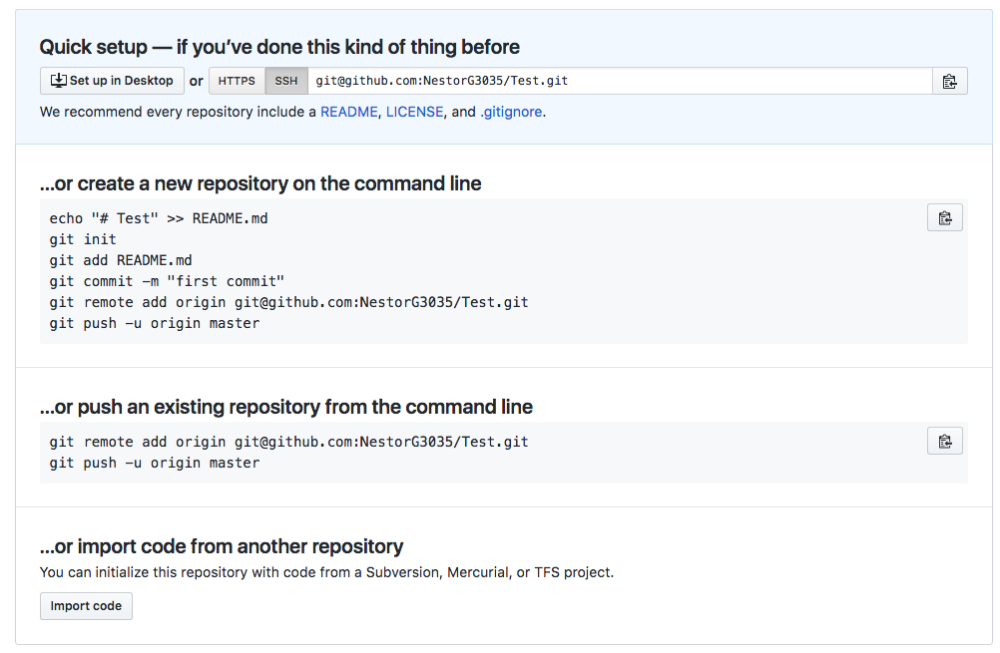

# GitHub Tutorial

_by **Nestor Gonzalez**_

---
## Git vs. GitHub
 _**Git**_ is a version-control system software thats used by software developers to save "snapshots" of code and keeps track of changes made to code and computer files.  
 _**Github**_ is a website that runs on Git. Github stores "in the cloud" any committed files that are pushed to your remote repository on Github. The _remote_ repository on Github works as a backup repository incase you lose your _local_ repository on cloud9.

---
## Initial Setup
##### Description  
Making a Github account is the most crucial step in this tutorial. Without Github, you wont be able to sign in to Cloud9 using the second sign in method (the "Sign in through Github" method). You also wont be able to push your Cloud9 code to a remote repository because there is no remote repository due to the fact that **there is no account**. So lets get started!  
##### How to make a Github account
1. Click "Sign Up" next to the "Sign in"  button on the top right corner of the Github website Home menu.
2. Follow the directions included in the first slide (Step 1) of the "Sign Up" tutorial of the Github website.  

  * Make a username
  * Add/Link an external email account 
  * Create a Password
3. Now your are in slide 2 (Step 2). This slide asks you if you want to include a monthly personal plan to your Github account. There are 2 options:
* $0 Personal Plan
* $7 Personal Plan  
Buying the $7 plan will enable certain features that are not included in the $0 personal plan. In the $0 dollar plan you are have a limited amount of privileges  

Congrats! Now you made a github account. Now you last step is to set up your SSH Key.  

After you have created your account and chosen your plan, you will be redirected to your github settings. you will be on your "Emails" settings tab.  
3 tabs below the settings tab is the **SSH and GPG Keys Tab**. Click on that tab. This will ask you to set up an SSH Key or GPG Key. Here is how you create an SSH Key:
1. Press the Green "New SSH Key Button"(You need to set up an SSH Key so that every time you want to push to github your wont have to sign in).
2. After you've done this, go to cloud9, press the gear icon on the top right, go to the "SSH Keys" tab and copy the 2nd SSH Key.
3. Go back to Github and paste the SSH Key into the text box that opened up after you did step 1. 
4. Add the SSH Key  

Now your account has an SSH Key between Github and CLoud9, you won't need to sign in to Github every time you push changes to the remote repo!

  

---
## Repository Setup
**How to make a repository**
1. Go to Github and the on the top right corner next to your profile picture/logo, press the `+` symbol and press "New Repository". Name the repository anything anything you want. But type the exact name of the repository when referencing. 
2. Create the repository. You will be redirected to a page that looks like this  

3. Make sure you are on the SSH tab that is displayed at the top, copy and paste the 2 lines of code on the "***...or push an existing repository from the command line***" section. Copy/Paste 1 line of code at a time onto your terminal. 
4. Type `git remote -v` onto your terminal and press enter. 
5. On your cloud9 workspace, open a new terminal
6. Type the command `mkdir` to make a new directory, type the name you want to give the directory after the command `mkdir`. For example, `mkdir broklyn`.
7. After that, type `cd` to start doing work _inside_ that new directory you made. **IF** you dont type this command, you will be doing work _outside_ of that directory. We need to avoid that since we are working _with_ the directory. For example `cd broklyn`.
8. Type `Git init`. This command will initilize your git repository. 
9. Make some changes inside your directory for example: make a a file and add some text into it.
10. Use the `git add .` to add those changes onto the stage. If you dont use `git add .` to add the changes to the stage, you wont be able to commit any changes. 
11. Next, use `git commit -m` and add a message after that block of code that describes what you did in that commit. for example, `git comit -m"adds text"`.

---
## Workflow & Commands
1. Use `git status` to check wether your changes are added to the stage. If they arent added to the stage, this will show up on your screen.  
  
if this is green, it means that the directory is added to the stage and is ready to commit. 
2. Use `git commit -m` with a message inside quotation marks to make a commit. For example: `git commit -m"adds words"` When you commmit, you have published your final edits. 
3. When you are ready to push the following changes to your backup/remote repository on github, used `git push -u orgin master`. It will send your changes to github. After you used this command, next time you push, just ytpe `git push`.

---
## Rolling Back Changes
Lets say you make a mistake on your directory but you **committed**. Death... right? Not exactly. Here is a few a few lines of code you can use to edit your commits.  
`git reset --soft HEAD~1` to uncommit your changes. You will be back to where you were after you did `git add .` Your work will be in the staging area.
Once you are back in the staging area, you can use `git reset HEAD filename` to unstage changes.  
Lets say you dont want to type so many things or want to uncommit and unstage with 1 code instead of using 2 codes. Just use `git reset HEAD~1`. 

Lets say you want to undo everything and erase your changes. just use `git reset --hard HEAD~1`
